# 🔧 Agentic Rules Framework - System Overview

## Architecture Deep Dive

This document provides a comprehensive technical overview of the Agentic Rules Framework architecture, design principles, and implementation details.

## 🏗️ Core Architecture

### Framework Philosophy

The Agentic Rules Framework is built on three foundational principles:

#### 1. **Distributed Rule Architecture**
- **No Central Controller**: Rules operate independently within their domains
- **Loose Coupling**: Rules communicate through shared data structures, not direct calls
- **Fault Isolation**: Rule failures don't cascade to other components
- **Modular Evolution**: New rules can be added without modifying existing ones

#### 2. **Algorithmic Behavioral Guidelines**
- **Not Binary Constraints**: Rules provide behavioral algorithms, not hard limits
- **Tool Agnostic**: Agents use available tools to implement rule requirements
- **Implementation Flexibility**: Multiple ways to achieve rule compliance
- **Progressive Enhancement**: Rules enhance existing capabilities

#### 3. **Self-Contained Distribution**
- **Zero Dependencies**: Framework works without external installations
- **Offline Capable**: All components embedded in single HTML file
- **Portable Configuration**: JSON-based configuration for easy deployment
- **Multi-Platform Ready**: Adaptable to different agentic environments

### Component Hierarchy

```
Framework Level
├── Bootstrap Orchestration (bootstrap.json)
├── Web Interface (setup.html)
├── CLI Tools (setup.py, setup-launcher.py)
└── Localization System (localization.json)

Rule Level
├── Memory Rules (modules/memory-rules/)
├── RAG Rules (modules/rag-rules/)
└── Critical Thinking Rules (modules/critical-thinking-rules/)

Implementation Level
├── Rule Templates (RULES.md.*)
├── Configuration Schemas (settings.json)
├── Setup Metadata (setup.json)
└── Generated Integrations (AGENTS.md)
```

## 🔄 Framework Lifecycle

### 1. Bootstrap Phase
```
Load bootstrap.json → Validate configuration → Initialize rule loading sequence
```

**Key Operations:**
- Configuration validation and integrity checking
- Rule dependency resolution and priority ordering
- Platform-specific adaptation initialization
- Security and permission setup

### 2. Rule Initialization Phase
```
For each enabled rule → Load settings → Validate configuration → Initialize algorithms
```

**Per-Rule Process:**
- Load rule-specific settings from `settings.json`
- Validate configuration against schema
- Initialize data structures and caches
- Establish interconnections with other rules

### 3. Runtime Operation Phase
```
User interaction → Rule algorithms execute → Results coordinated → Response generated
```

**Coordinated Execution:**
- Rules operate in parallel within their domains
- Results aggregated through bootstrap orchestration
- Cross-rule consistency validation
- Response optimization and finalization

## 📋 Technical Specifications

### Bootstrap Configuration Schema

```json
{
  "_metadata": {
    "version": "1.0.0",
    "compatibility": ["cursor", "vscode", "custom"],
    "license": "MIT"
  },
  "loading_sequence": [
    "memory-rules",
    "rag-rules",
    "critical-thinking-rules"
  ],
  "interconnections": {
    "memory_rag_sharing": true,
    "critical_memory_learning": true,
    "rag_critical_validation": true
  },
  "platform_adaptations": {
    "cursor": { /* Cursor-specific settings */ },
    "vscode": { /* VSCode-specific settings */ }
  }
}
```

### Rule Configuration Schema

```json
{
  "_metadata": {
    "rule_name": "memory-rules",
    "version": "1.0.0",
    "compatibility": ["cursor", "vscode"],
    "dependencies": ["rag-rules"]
  },
  "mandatory_config": [
    {
      "name": "storage_path",
      "type": "path",
      "validation": "writable_directory"
    }
  ],
  "optional_config": [
    {
      "name": "retention_days",
      "type": "number",
      "default": 90,
      "range": [30, 365]
    }
  ]
}
```

### Generated Integration Format

```
# Rule Title

**⚠️ SAFETY PRECAUTION**: Template activation required

**MANDATORY**: Implementation requirements

## Algorithm Specifications

### Algorithm: Process_Name
**MANDATORY**: Execution conditions

**Steps**:
1. Step-by-step implementation
2. Validation requirements
3. Error handling procedures

**Settings Compliance**: Configuration integration
```

## 🔗 Rule Interconnections

### Memory ↔ RAG Integration

**Data Flow:**
```
User Query → RAG Context Retrieval → Memory Personalization → Enhanced Context → Response Generation
```

**Shared Resources:**
- Context embeddings and relevance scores
- User preference patterns from memory
- Retrieval strategy optimization based on success history

### Critical Thinking ↔ Memory Integration

**Feedback Loop:**
```
Response Generation → Critical Analysis → Error Detection → Memory Storage → Future Improvement
```

**Quality Assurance:**
- Validation of stored information accuracy
- Correction learning and pattern recognition
- Confidence calibration based on historical performance

### RAG ↔ Critical Thinking Integration

**Validation Pipeline:**
```
Information Retrieval → Critical Verification → Source Validation → Confidence Scoring → Response Qualification
```

**Quality Gates:**
- Source credibility assessment
- Logical consistency verification
- Assumption testing and validation

## 🧠 Knowledge Graph (KG) Architecture

### KG Construction Pipeline

The framework implements a sophisticated Knowledge Graph construction system that automatically builds semantic relationships between project components.


#### Core KG Algorithms

**1. Structured Entity Extraction**
```python
Algorithm: Extract entities from codebase
Input: Source code, documentation, configuration files
Process:
├── Tokenization and POS tagging
├── Named entity recognition (NER)
├── Domain-specific pattern matching
├── Confidence scoring and validation
Output: Categorized entities (functions, classes, files, concepts)
```

**2. Pattern-Based Relationship Discovery**
```python
Algorithm: Identify relationships between entities
Input: Entity list, contextual information
Process:
├── Syntactic pattern matching (subject-verb-object)
├── Dependency analysis (imports, calls, inheritance)
├── Semantic linking (concept relationships)
├── Temporal relationship detection
Output: Typed relationships with confidence scores
```

**3. Incremental Graph Builder**
```python
Algorithm: Construct and maintain knowledge graph
Input: New entities, relationships, existing graph
Process:
├── Graph initialization with existing nodes/edges
├── Entity deduplication and merging
├── Relationship consistency validation
├── Graph optimization and indexing
├── Memory persistence with metadata
Output: Updated KG with query interfaces
```

### KG Architecture Components

#### **Graph Storage Layer**
```
Memory System Integration:
├── Primary Storage: /lm/projects/{project}/kg/
├── Backup Storage: /lm/common/knowledge_graph/
├── Metadata Storage: Graph construction timestamps, versions
├── Query Index: Optimized for relationship traversal
```

#### **Query Processing Engine**
```
Semantic Query Processing:
├── Natural Language → Entity/Intent Parsing
├── Graph Traversal Algorithms (BFS/DFS with depth limits)
├── Relationship Filtering and Ranking
├── Context Expansion from Connected Nodes
├── Relevance Scoring and Response Synthesis
```

#### **Background Processing Architecture**
```
Asynchronous KG Construction:
├── Trigger Detection: Project analysis, file changes, user queries
├── Batch Processing: Entity extraction in configurable chunks
├── Incremental Updates: Only process changed components
├── Resource Management: CPU/memory limits, timeout controls
├── Persistence Queue: Store results without blocking user interaction
```

### KG Integration with Rule Systems

#### **RAG Rules ↔ KG Integration**
```
Information Retrieval Enhancement:
├── Traditional RAG: Keyword-based document retrieval
├── KG-Enhanced RAG: Semantic relationship traversal
├── Hybrid Scoring: Combine keyword relevance + graph centrality
├── Context Expansion: Include related concepts and dependencies
```

#### **Memory Rules ↔ KG Integration**
```
Persistent Knowledge Storage:
├── KG Structure: Stored in specialized memory categories
├── Relationship Preservation: Maintain graph topology across sessions
├── Query History: Learn from successful KG queries
├── Context Linking: Connect KG insights to conversational context
```

#### **Critical Thinking ↔ KG Integration**
```
Knowledge Validation:
├── Source Verification: Check KG relationships against known facts
├── Consistency Analysis: Validate graph relationships for logical conflicts
├── Uncertainty Quantification: Assign confidence scores to graph elements
├── Error Detection: Identify potentially incorrect relationships
```

### KG Performance Characteristics

#### **Scalability Metrics**
```
Current Baseline (28 nodes, 47 relationships):
├── Construction Time: <30 seconds for project analysis
├── Query Performance: <250ms average response time
├── Memory Usage: ~135KB for project KG data
├── Update Frequency: Incremental, triggered by changes

Projected Growth (50 nodes, 100 relationships):
├── Construction Time: <45 seconds with batch processing
├── Query Performance: <500ms with optimized indexing
├── Memory Usage: ~250KB with compression
├── Real-time Updates: Background processing maintains performance
```

#### **Quality Assurance**
```
Graph Validation:
├── Entity Accuracy: >95% correct entity identification
├── Relationship Precision: >90% accurate relationship mapping
├── Graph Consistency: Automatic conflict resolution
├── Query Relevance: Semantic matching with fallback to keyword search
```

### KG Visualization & Analysis

#### **Mermaid Framework Architecture**

```mermaid
graph TB
    subgraph "Rule Modules (Community 1)"
        RM[Rule Modules]
        RM --> RAG[RAG Rules<br/>• KG algorithms<br/>• Entity extraction<br/>• Relations]
        RM --> MEM[Memory Rules<br/>• Persistence<br/>• 8 categories<br/>• KG storage]
        RM --> CT[Critical Thinking<br/>• Error prevention<br/>• Verification<br/>• Ground checking]
        RM --> AIT[Agent Interaction<br/>• Test framework<br/>• Quality assurance]
    end

    subgraph "Setup System (Community 2)"
        SS[Setup System]
        SS --> SP[setup.py<br/>• Rule activation<br/>• AGENTS.md gen<br/>• Config orchestration]
        SS --> SH[setup.html<br/>• Web UI<br/>• Real-time updates<br/>• Multi-language]
        SS --> WC[web-config.json<br/>• Plugin discovery<br/>• Configuration hub]
        SS --> GS[generate_simple_setup.py<br/>• Automation<br/>• File generation]
    end

    subgraph "Memory System (Community 3)"
        MS[Memory System]
        MS --> LMS[/lm/ storage<br/>• common/<br/>• private/<br/>• projects/]
        MS --> CAT[Categories<br/>• technical<br/>• behavioral<br/>• contextual<br/>• session<br/>• git_history]
        MS --> KG[KG Data<br/>• Graph persistence<br/>• Query storage<br/>• Relationship data]
    end

    subgraph "Documentation (Community 4)"
        DOC[Documentation]
        DOC --> README[README.md<br/>• Framework overview<br/>• Setup instructions<br/>• Multi-language]
        DOC --> UL[update_localization.py<br/>• Translation updates<br/>• Language maintenance]
        DOC --> LOC[localization.json<br/>• EN/JA/ID support<br/>• UI translations<br/>• Error messages]
    end

    %% Relationships
    RAG -->|"KG data persistence"| MEM
    MEM -->|"context for KG enrichment"| RAG
    CT -->|"error logs"| MEM
    MEM -->|"learning data"| CT
    MEM -->|"test results"| AIT

    SP -->|"configuration generation"| WC
    WC -->|"dynamic loading"| SH
    SH -->|"language support"| LOC
    GS -->|"automation"| WC

    MEM -->|"data persistence"| LMS
    RAG -->|"KG storage"| KG
    CAT -->|"categorized storage"| LMS

    README -->|"setup instructions"| SP
    LOC -->|"translations"| README
    UL -->|"update automation"| LOC

    classDef rules fill:#e1f5fe,stroke:#01579b,stroke-width:2px
    classDef setup fill:#f3e5f5,stroke:#4a148c,stroke-width:2px
    classDef memory fill:#e8f5e8,stroke:#1b5e20,stroke-width:2px
    classDef docs fill:#fff3e0,stroke:#e65100,stroke-width:2px

    class RM,RAG,MEM,CT,AIT rules
    class SS,SP,SH,WC,GS setup
    class MS,LMS,CAT,KG memory
    class DOC,README,UL,LOC docs
```


#### **ASCII Graph Representation** (Alternative View)
```
Framework Architecture KG:
┌─────────────────┐    ┌─────────────────┐    ┌─────────────────┐
│   Rule Modules  │◄───┤  Setup System   │◄───┤  Memory System  │
│                 │    │                 │    │                 │
│ • RAG Rules     │    │ • setup.py      │    │ • /lm/ storage  │
│ • Memory Rules  │    │ • setup.html    │    │ • Categories    │
│ • Critical Thin │    │ • web-config    │    │ • Persistence   │
└─────────────────┘    └─────────────────┘    └─────────────────┘
        ▲                        ▲                        ▲
        │                        │                        │
┌─────────────────┐    ┌─────────────────┐    ┌─────────────────┐
│ Documentation   │◄───┤  Localization   │◄───┤ Configuration   │
│                 │    │                 │    │                 │
│ • README.md     │    │ • JSON files    │    │ • settings.json │
│ • Guides        │    │ • Multi-lang    │    │ • bootstrap.json│
│ • API docs      │    │ • Translations  │    │ • Environment   │
└─────────────────┘    └─────────────────┘    └─────────────────┘
```

#### **Relationship Types Legend**
- **───**: Direct dependency (strong coupling)
- **◄───**: Data flow relationship
- **····**: Indirect or optional relationship
- **━━━━**: Critical path or primary workflow

### KG Query Interface

#### **Query Types Supported**
```
1. Structural Queries: "What depends on component X?"
2. Relationship Queries: "How are A and B connected?"
3. Pattern Queries: "Find similar structures to Y"
4. Impact Analysis: "What breaks if I change Z?"
5. Navigation Queries: "Show me the path from A to B"
```

#### **Query Processing Pipeline**
```
Natural Language Query → Intent Classification → Entity Resolution → Graph Traversal → Result Ranking → Response Synthesis
```

### KG Maintenance & Evolution

#### **Automatic Updates**
- **Change Detection**: File system monitoring for modifications
- **Incremental Updates**: Only rebuild affected portions of graph
- **Version Control**: Track KG evolution alongside code changes
- **Performance Monitoring**: Query performance and accuracy metrics

#### **Quality Maintenance**
- **Consistency Checks**: Regular validation of graph relationships
- **Accuracy Verification**: Cross-reference with source code
- **Performance Tuning**: Optimize query patterns and indexing
- **User Feedback Integration**: Learn from query success/failure patterns

## 🌍 Multi-Platform Architecture

### Platform Abstraction Layer

```json
{
  "platform_adapters": {
    "cursor": {
      "file_system": "cursor_workspace",
      "tool_integration": "cursor_tools",
      "memory_persistence": "cursor_storage"
    },
    "vscode": {
      "file_system": "workspace_folders",
      "tool_integration": "vscode_extensions",
      "memory_persistence": "workspace_settings"
    },
    "custom": {
      "file_system": "configurable_paths",
      "tool_integration": "api_endpoints",
      "memory_persistence": "custom_storage"
    }
  }
}
```

### Environment Detection

**Automatic Platform Recognition:**
- File system structure analysis
- Available tool detection
- Configuration file presence
- Runtime environment variables

## 🔒 Security & Safety Architecture

### Safety Mechanisms

#### Template Activation Safety
- **No Auto-Loading**: Rules must be explicitly activated by users
- **Template Markers**: Clear indicators prevent accidental activation
- **User Consent**: Explicit confirmation required for rule activation

#### Runtime Safety
- **Error Containment**: Rule failures isolated from system operation
- **Resource Limits**: Configurable timeouts and resource constraints
- **Audit Logging**: All rule operations logged for review

### Data Protection

#### Memory Security
- **Encryption Options**: Sensitive data can be encrypted
- **Access Controls**: Different permission levels for memory categories
- **Retention Policies**: Automatic cleanup of expired data

#### Configuration Security
- **Validation**: All configurations validated against schemas
- **Sanitization**: Input validation and sanitization
- **Backup**: Automatic backup before configuration changes

## 📊 Performance Architecture

### Optimization Strategies

#### Memory Management
- **Lazy Loading**: Components loaded on demand
- **Caching Layers**: Multi-level caching for performance
- **Compression**: Automatic compression for large datasets
- **Indexing**: Optimized indexes for fast retrieval

#### Processing Optimization
- **Parallel Execution**: Rules execute in parallel when possible
- **Batch Processing**: Group operations for efficiency
- **Progressive Loading**: Load critical components first
- **Background Tasks**: Non-blocking background operations

### Scalability Considerations

#### Resource Scaling
- **Memory Limits**: Configurable memory usage limits
- **Processing Timeouts**: Configurable operation timeouts
- **Storage Quotas**: Configurable storage size limits
- **Concurrent Operations**: Limits on simultaneous operations

## 🔧 Development & Extension

### Adding New Rules

**Step-by-Step Process:**

1. **Directory Creation**: `mkdir new-rule-rules/`
2. **Template Development**: Create `RULES.md.en` with algorithms
3. **Configuration Schema**: Define `settings.json` and `setup.json`
4. **Localization**: Add strings to `localization.json`
5. **Bootstrap Integration**: Add to `bootstrap.json` loading sequence
6. **Web Interface**: Run `generate_simple_setup.py` to update UI
7. **Testing**: Validate across all supported platforms

### Rule Development Guidelines

#### Algorithm Design
- **Clear Objectives**: Each algorithm has specific, measurable goals
- **Implementation Flexibility**: Multiple implementation approaches allowed
- **Error Handling**: Comprehensive error detection and recovery
- **Performance Awareness**: Efficient resource usage considerations

#### Configuration Design
- **Progressive Disclosure**: Simple defaults with advanced options
- **Validation**: Comprehensive input validation and error messages
- **Documentation**: Clear explanation of each configuration option
- **Compatibility**: Backward compatibility with existing configurations

### Quality Assurance

#### Testing Requirements
- **Unit Tests**: Individual algorithm testing
- **Integration Tests**: Cross-rule interaction testing
- **Platform Tests**: Testing across all supported platforms
- **Performance Tests**: Load and performance validation

#### Validation Checks
- **Schema Compliance**: All configurations match defined schemas
- **Localization Coverage**: All user-facing strings localized
- **Documentation Completeness**: All features documented
- **Compatibility**: No breaking changes to existing integrations

## 📈 Evolution & Maintenance

### Version Compatibility

**Semantic Versioning:**
- **MAJOR**: Breaking changes to rule interfaces or bootstrap format
- **MINOR**: New features and rule additions
- **PATCH**: Bug fixes and performance improvements

### Backward Compatibility

**Migration Strategies:**
- **Configuration Migration**: Automatic migration of user settings
- **Rule Compatibility**: New rules don't break existing integrations
- **Platform Support**: Maintain compatibility across platform versions

### Deprecation Policy

**Graceful Transitions:**
- **Warning Period**: Deprecated features issue warnings
- **Migration Tools**: Automated migration assistance
- **Support Timeline**: Minimum 6-month support for deprecated features

## 🔬 Research & Innovation

### Current Research Areas

#### Advanced Memory Systems
- **Semantic Memory**: Understanding-based storage and retrieval
- **Episodic Memory**: Event-based memory with temporal relationships
- **Procedural Memory**: Process and workflow memory
- **Emotional Memory**: User sentiment and preference learning

#### Enhanced Reasoning
- **Causal Reasoning**: Understanding cause-and-effect relationships
- **Analogical Reasoning**: Pattern recognition and application
- **Abductive Reasoning**: Hypothesis generation and testing
- **Meta-Reasoning**: Reasoning about reasoning processes

#### Context Optimization
- **Dynamic Context Windows**: Adaptive context sizing
- **Multi-Modal Integration**: Text, code, and visual context
- **Real-time Adaptation**: Context adjustment during conversations
- **Personalization**: User-specific context optimization

### Future Directions

#### Autonomous Learning
- **Self-Improvement**: Rules that learn and optimize themselves
- **User Adaptation**: Deep personalization based on interaction patterns
- **Cross-Session Learning**: Knowledge accumulation across all user interactions

#### Advanced Integration
- **Multi-Agent Coordination**: Rules for agent collaboration
- **External API Integration**: Rules for third-party service integration
- **Real-time Collaboration**: Rules for multi-user environments

---

## 📚 Additional Resources

- **[../README.md](../README.md)** - Quick start and overview
- **[../CORE-RULES.md](../CORE-RULES.md)** - Framework principles
- **[USER-GUIDE.md](USER-GUIDE.md)** - End-user setup guide
- **[DEVELOPER-GUIDE.md](DEVELOPER-GUIDE.md)** - Technical implementation guide
- **[EXTENSION-MANUAL.md](EXTENSION-MANUAL.md)** - Framework extension guide

---

**🔧 System Overview**: Comprehensive technical architecture and design principles of the Agentic Rules Framework.

## Localization / 多言語対応 / Pelokalan

<details>
<summary>🌍 This document is also available in / このドキュメントは以下の言語でも利用可能です / Dokumen ini juga tersedia dalam</summary>

- **[日本語 (Japanese)](localization/ja/SYSTEM-OVERVIEW.ja.md)** - システムの説明
- **[Bahasa Indonesia (Indonesian)](localization/id/SYSTEM-OVERVIEW.id.md)** - Ikhtisar Sistem

</details>

*Copyright (c) 2025 Paulus Ery Wasito Adhi. Licensed under the MIT License.*
