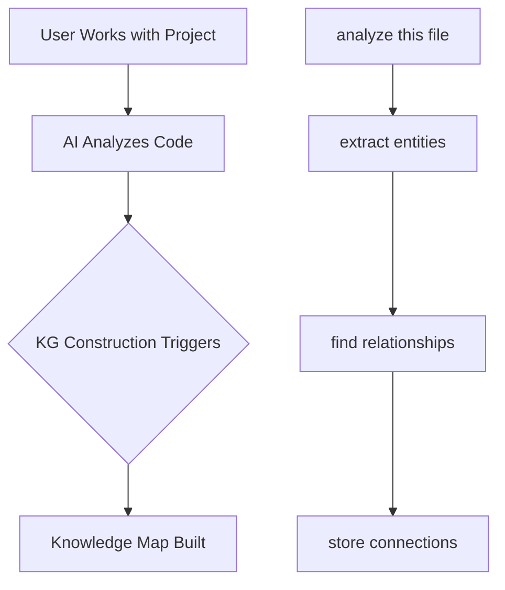
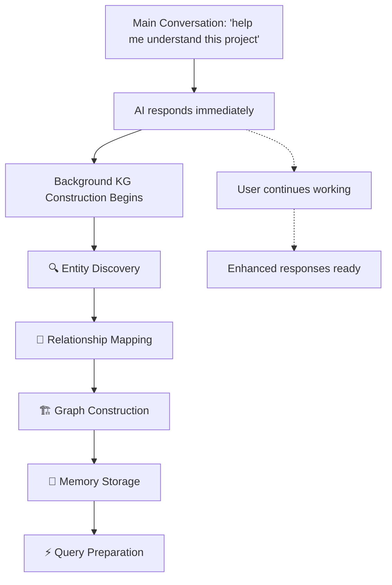
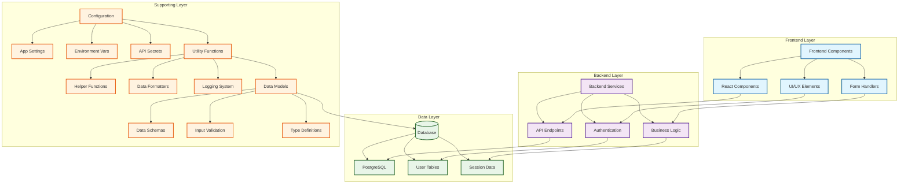
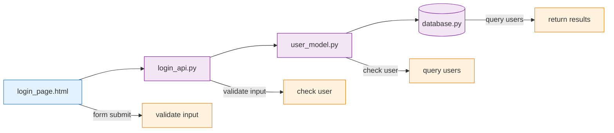

# 👥 User Guide - Agentic Rules Framework

## For Everyone (No Technical Knowledge Required!)

**Zero technical knowledge required!** This guide will walk you through setting up AI agent rules with simple double-clicks.

## 🚀 First Time Setup - Complete Process

### ⚠️ **IMPORTANT: Follow This Order!**

**Complete setup.html FIRST, then bootstrap initialization. The web interface creates required files that bootstrap needs.**

---

### **Phase 1: Web Configuration (REQUIRED FIRST)**

#### **Step 1: Download and Launch Setup**
1. **Download** the `agentic-rules` framework files from GitHub
2. **Extract** files to any folder on your computer
3. **Double-click** `setup.html` to open the web interface

#### **Step 2: Configure Your Rules**
1. **Select Language** from supported options
2. **Choose Rules** you want to enable:
   - 🧠 **Memory Rules**: AI remembers context across conversations
   - 📚 **RAG Rules**: AI finds and uses relevant information better
   - 🤔 **Critical Thinking Rules**: AI is more careful and accurate
3. **Click "Generate Configuration Files"**

> 💡 **This creates the rule files and configurations that bootstrap needs!**

---

### **Phase 2: Bootstrap Initialization (AFTER setup.html)**

#### **Step 3: Initialize Framework**
Tell your AI agent: **`Initialize agentic rules system`** or **`Setup agentic rules bootstrap`**

#### **Step 4: Grant Bootstrap Permission**
When prompted: *"Bootstrap configuration not found. Initialize Agentic Rules Framework? (y/n)"*
- Type: `y` and press Enter

#### **Step 5: Confirm User Consent**
When prompted: *"The Agentic Rules Framework enhances AI behavior... Do you want to enable this framework? (y/n)"*
- Type: `y` and press Enter

#### **Step 6: Review Framework Settings**
Review settings for your chosen rules. These should match your setup.html selections.

#### **Step 7: Framework Active!**
✅ **Setup complete** - both web config and bootstrap initialization done
✅ **Rules configured** - your selected features are active
✅ **Ready to use** - enhanced AI capabilities available automatically

---

## 🚀 Using Framework Features

Choose the method that works best for you:

### ⚡ **Method 1: Direct Agent Command (After Setup)**
**Framework features work automatically once initialized!**

1. **Framework Active**: After initialization, all rules work automatically
2. **No Manual Setup**: Features activate based on your confirmed settings
3. **Persistent**: System remembers your setup - no repeated prompts
4. **Smart**: Rules apply intelligently based on context

**Benefits:**
- ✅ **Automatic**: Framework activates immediately with your agent
- ✅ **No Files**: No downloads or file management needed
- ✅ **Persistent**: System remembers setup - no repeated prompts
- ✅ **Smart**: Only asked for permission once during initialization

### 🖱️ **Method 2: Web Interface Setup (Alternative)**
For users who prefer visual configuration:

#### Step 1: Download the Framework
1. Download the `agentic-rules` framework files from GitHub
2. Extract/unzip the downloaded files to any folder on your computer

#### Step 2: Launch the Setup
1. **Double-click** `setup.html` in the extracted folder
2. Your default web browser will open automatically

#### Step 3: Configure Your Rules
1. **Choose Language**: Select from officially supported languages
   - 🇺🇸 **English** (Primary language)
   - 🇯🇵 **日本語** (Japanese)
   - 🇮🇩 **Bahasa Indonesia** (Indonesian)

   > 💡 **For Plugin Developers**: If you want to create custom plugins with additional languages (🇩🇪 Deutsch, 🇫🇷 Français, 🇪🇸 Español, etc.), see the [Extension Manual](EXTENSION-MANUAL.md) for technical details on using `generate_plugin_scaffold.py` with multi-language template support.
2. **Select Rules**: Check the boxes for AI behaviors you want:
   - 🧠 **Memory Rules**: Helps AI remember context across conversations
   - 📚 **RAG Rules**: Improves AI's ability to find and use relevant information
   - 🤔 **Critical Thinking Rules**: Makes AI more careful and accurate

#### Step 4: Generate Configuration
1. Click **"Generate Configuration Files"**
2. The interface will create your personalized AI rules

#### Step 5: Save Your Files
Choose how you want to save the files:

- **💾 Save**: Opens a file browser to choose exactly where to save
- **📥 Download**: Downloads files directly to your Downloads folder
- **📋 Copy**: Copies content to clipboard for manual saving

#### Step 6: Use with Your AI Agent
1. Copy the generated files to your AI project's root directory
2. Configure your AI agent to load the rule files
3. Your AI agent now has enhanced capabilities!

## 📂 File Structure After Setup

Your AI project should look like this:
```
your-ai-project/
├── AGENTS.md              # Main agent configuration
├── modules/               # Plugin modules directory
│   ├── memory-rules/      # Memory system rules
│   │   ├── AGENTS.md     # Memory-specific rules
│   │   └── settings.json # Memory configuration
│   ├── rag-rules/        # RAG system rules
│   │   ├── AGENTS.md     # RAG-specific rules
│   │   └── settings.json # RAG configuration
│   └── critical-thinking-rules/  # Critical thinking rules
│       ├── AGENTS.md     # Thinking-specific rules
│       └── settings.json # Thinking configuration
```

## 🎯 What Each Rule Does

### 🧠 Memory Rules
- Remembers important information across conversations
- Maintains context between sessions
- Helps AI learn from past interactions

### 📚 RAG Rules
- Finds relevant information from your files
- Optimizes how AI reads and processes information
- Improves response accuracy with better context

### 🤔 Critical Thinking Rules
- Makes AI double-check its answers
- Reduces mistakes and "hallucinations"
- Promotes more careful and accurate responses

### 🧠 Knowledge Graph (KG) Intelligence
- **Automatic Learning**: AI builds knowledge maps of your projects
- **Smart Connections**: Discovers relationships between code, files, and concepts
- **Enhanced Understanding**: Provides deeper insights about your codebase
- **Contextual Memory**: Remembers how different parts of your project relate

## 🧠 How Knowledge Graphs Enhance Your AI Experience

### What Are Knowledge Graphs?

Knowledge Graphs (KGs) are intelligent maps that your AI builds automatically. They create visual connections between different parts of your projects, making your AI "understand" your codebase like a human expert would.

```
🎯 Example: Your AI analyzes this codebase and creates connections:

Code Files ←→ Functions ←→ Dependencies ←→ Features
    ↓           ↓           ↓           ↓
"main.py" ←→ "process_data()" ←→ "pandas" ←→ "Data Processing"
"utils.py" ←→ "validate_input()" ←→ "None" ←→ "Input Validation"
"config.py" ←→ "load_settings()" ←→ "json" ←→ "Configuration"
```

### How KG Construction Works Automatically

**🤖 Single Agent Architecture**: Your AI agent builds KGs using its own intelligence + framework algorithms



**⚡ Background Processing**: KG building happens invisibly while you work:



### Practical Benefits You Get

#### **1. Smarter Code Explanations**
```
❌ Without KG: "This function processes user input"
✅ With KG: "validate_input() processes user data, connects to error_handler() for validation,
            used by process_user_request() in main.py, and handles data sanitization"
```

#### **2. Intelligent Project Navigation**
```
User: "How does the authentication system work?"
KG-Powered AI: Shows complete auth flow with all connected components
```

#### **3. Dependency Understanding**
```
User: "What happens if I change this database config?"
KG-Powered AI: "Affects: user_auth() → db_connection() → data_validator() → api_response()"
```

#### **4. Pattern Recognition**
```
User: "Similar to my user login system?"
KG-Powered AI: "Your auth pattern matches: login_flow() → validate_creds() → create_session()"
```

### KG Visualization Examples

#### **Project Architecture Map**


#### **Component Relationship Web**


### When KGs Are Most Helpful

#### **🚀 Best For:**
- **Large Codebases**: Understanding complex project structures
- **Team Collaboration**: Onboarding new developers
- **Architecture Decisions**: Planning feature additions
- **Debugging**: Tracing issues through connected components
- **Refactoring**: Understanding impact of code changes

#### **📈 Advanced Queries You Can Ask:**
```
"Show me all functions that handle user data"
"What components depend on the payment system?"
"How does error handling flow through the application?"
"Find similar patterns to my new feature"
"What would break if I change this database schema?"
```

### KG Construction Settings

**For Advanced Users**: You can control KG behavior in `modules/rag-rules/settings.json`:

```json
{
  "kg_background_processing": {
    "enabled": true,              // Enable automatic KG building
    "separate_conversation": true, // Never interrupt your work
    "minimal_construction": true,  // Only build what's needed
    "project_analysis_only": true, // Scope to current project
    "batch_processing": true,      // Process efficiently
    "no_user_waiting": true        // Instant responses always
  }
}
```

### Privacy & Performance

**🛡️ Your Data Stays Private:**
- KGs are built from your local files only
- No data is sent to external servers
- Knowledge stays within your project environment

**⚡ Performance Optimized:**
- Background processing prevents slowdowns
- Incremental updates (only changes are processed)
- Smart caching for frequently accessed components
- Minimal memory footprint

### Getting Started with KG Intelligence

**🎯 Simple Start:**
1. **Enable RAG Rules** in setup.html (includes KG capabilities)
2. **Work normally** - KGs build automatically in background
3. **Ask deeper questions** - AI now understands project relationships
4. **Experience enhanced responses** - More accurate, contextual answers

**That's it!** Your AI becomes significantly smarter about your codebase through automatic KG construction. 🧠✨

## 🔧 Troubleshooting

### Setup Won't Open
- Try right-clicking `setup.html` and selecting "Open with" your web browser
- Make sure you're opening the file from the extracted folder, not from within a ZIP archive

### Files Won't Save
- Check that your browser has permission to save files
- Try using the **📥 Download** option first, then move files manually

### Language Not Changing
- Refresh the page after changing the language
- Clear your browser cache if translations don't appear

## 💡 Tips

- **Start Simple**: Begin with just 1-2 rules to understand how they work
- **Test Gradually**: Try your AI agent with the new rules on simple tasks first
- **Backup First**: Save your existing AI configurations before adding new rules
- **Experiment**: Different combinations of rules work better for different types of tasks

## 📞 Need Help?

- Check the [troubleshooting section](#-troubleshooting) above
- Review the [developer guide](DEVELOPER-GUIDE.md) for advanced options
- Open an issue on GitHub for technical problems

---

**🎉 Congratulations!** Your AI agent now has enhanced capabilities through the Agentic Rules Framework.

## Localization / 多言語対応 / Pelokalan

<details>
<summary>🌍 This guide is also available in / このガイドは以下の言語でも利用可能です / Panduan ini juga tersedia dalam</summary>

- **[日本語 (Japanese)](localization/ja/USER-GUIDE.ja.md)** - ユーザーガイド
- **[Bahasa Indonesia (Indonesian)](localization/id/USER-GUIDE.id.md)** - Panduan Pengguna

</details>

---

Copyright (c) 2025 Paulus Ery Wasito Adhi. Licensed under the MIT License (see LICENSE file).
